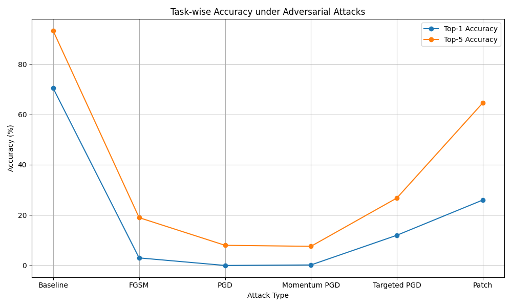
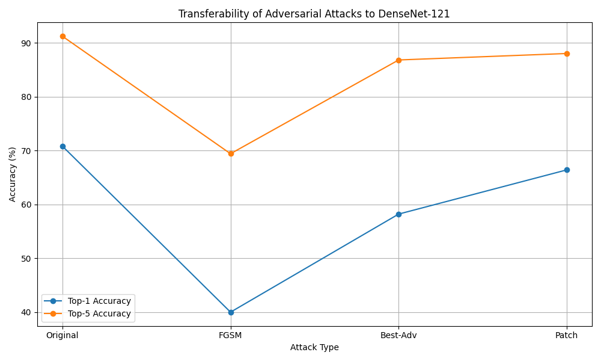

# Jailbreaking Deep Models: Adversarial Attacks on ResNet-34

This repository contains the implementation and evaluation for Deep Learning Project 3 (Spring 2025, NYU Tandon). We attack a pretrained ResNet-34 model using ℓ∞-bounded adversarial perturbations, including FGSM, PGD, Momentum PGD, and Patch PGD, and assess transferability to DenseNet-121.

**Developers**:  
- Ashutosh Agrawal  
- Siddhanth Rana  
- Aneesh Mokashi  

**Course**: Deep Learning – Spring 2025  
**Professor**: Chinmay Hegde    
**Project**: Mini Project 3 — Adversarial Attacks on ResNet-34  
---

## ⚙️ Prerequisites

- Python 3.8+
- PyTorch 1.12+ and TorchVision
- NumPy, Matplotlib
- Jupyter Notebook


---

## 🚀 Usage

### 1. Data Preparation

Place the 500-image ImageNet subset in the directory:

```
/TestData
```

### 2. Run the Notebook

```bash
jupyter notebook "project-3-jailbreaking-deep-learning-models.ipynb"
```

This performs:
- Clean accuracy evaluation
- FGSM, PGD, Momentum PGD, Targeted PGD
- Patch-based PGD (32×32 region)
- Transferability evaluation on DenseNet-121
- Visualization of results

---

## 📊 Results

| Attack                | Top-1 (%) | Top-5 (%) |
|-----------------------|-----------|-----------|
| Clean                 | 70.4      | 93.2      |
| FGSM (ε=0.02)         | 3.0       | 19.0      |
| PGD (10 iters, ε=0.02)| 0.0       | 8.0       |
| Momentum PGD (μ=0.9)  | 0.2       | 7.6       |
| Targeted PGD          | 12.0      | 26.8      |
| Patch PGD (ε=0.5)     | 26.0      | 64.6      |



### Transferability to DenseNet-121

| Attack   | Top-1 (%) | Top-5 (%) |
|----------|-----------|-----------|
| Original | 70.8      | 91.2      |
| FGSM     | 40.0      | 69.4      |
| Best-Adv | 58.2      | 86.8      |
| Patch    | 66.4      | 88.0      |



---

## 🔍 Key Features

- Modular attack functions (FGSM, PGD, Momentum, Patch)
- Custom ImageNet subset loader
- Full logging of accuracy, perturbation norm, and generation time
- Top-1/Top-5 accuracy plots and transferability evaluation
- Clean and adversarial example saving for qualitative analysis

---

## 📚 References

- Goodfellow et al., *Explaining and Harnessing Adversarial Examples*, ICLR 2015
- Madry et al., *Towards Deep Learning Models Resistant to Adversarial Attacks*, ICLR 2018
- Brown et al., *Adversarial Patch*, arXiv 2017
---
